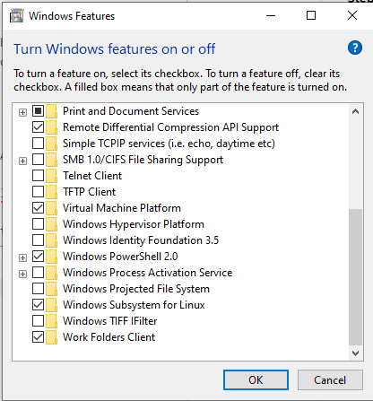

Getting set up with Linux on Windows
==============================

These notes will provide links and information on how to set up Linux on a Windows system and how to get Atom installed.

# Table of Contents
1. [Enabling Windows Subsystem for Linux](#enabling-windows-subsystem-for-linux)
2. [Installing Atom for Linux](#installing-atom-for-linux)     
3. [Sources](#sources)

# Enabling Windows Subsystem for Linux

**Step 1:**    
Open the `PowerShell` as an Administrator and enter the following:   
`dism.exe /online /enable-feature /featurename:Microsoft-Windows-Subsystem-Linux /all /norestart`   

**Step 2:**   
At this point, I am assuming your system can work with Linux. To make sure, for x86 systems, the Version should be 1903 or higher, and the Build should be 18362 or higher.

If this is not the case, you can upgrade Windows.

**Step 3:**    
Here, we need to enable the Virtual Machine feature. Again, with the `PowerShell` in Administrator, type the following:     
`dism.exe /online /enable-feature /featurename:VirtualMachinePlatform /all /norestart`     

You may get an error message around here saying that the Virtual Machine Platform needs to be enabled. To do this, in the Windows search bar type `Turn windows features on or off`. With this done, you should see the following:    

     

Make sure the `Virtual Machine Platform` is enabled and press `OK`. Now run the previous command again.     

**Step 4:**    
Back to the `PowerShell`, and type in: `wsl --set-default-version 2`     

**Step 5:**     
Open the [Microsoft Store](https://aka.ms/wslstore). Here, select the disto you wish to have.   

Once installed, you will be asked to provide a username and password.

# Installing Atom for Linux    
**Step 1:**     
Download Atom from the [official website](https://atom.io/).     

**Step 2:**    
Add Atom to the Windows environment variables path. This can be done a number of was.
- In Windows, search for "Edit the system environment variables"
- Press `win+r` and type `SystemPropertiesAdvanced.exe`    

With the system properties window open, in the `Environment Variables` section, and then in the `System Variables` window, open the `Path` variable. The three windows you will need are shown above.       

The image above shows how Atom is added to the path. The user needs to locate the `bin` folder for Atom. If installed with the default settings it can typically be found in: `C:\Users\<user-name>\AppData\Local\atom\bin`     

**Step 3:**   
Now we need to make WSL aware of Atom. This is done my altering the `bashrc` file. This file can be opened with `vim` text editor, however, I have found `nano` to be easier to use. This can be installed with the following commands:

* `sudo apt update`: this updates all repositories     
* `sudo apt install nano`: this installs Nano     

**Step 4:**     
with `nano` installed, enter the following command: `nano ~/.bashrc`, and using the down arrow, move to the bottom of the file and add the following: `alias atom="/mnt/c/Windows/System32/cmd.exe /c 'atom'"`, then save and exit the file (commands for this will be shown at the bottom of the editor). The final. important step is to source the `bashrc` file again, by using: `source ~/.bashrc`. Now, we can open Atom using `atom . &`   

Notes for this section:  
- https://medium.com/@rhdzmota/python-development-on-the-windows-subsystem-for-linux-wsl-17a0fa1839d     

- Instead of vim, use nano:    
https://linuxize.com/post/how-to-create-bash-aliases/    

- To add info to bashrc file, can use the following:     
`echo export JAVA_HOME=/usr/lib/jvm/java-1.8.0-openjdk-amd64 >> ${HOME}/.bashrc`     
But really using nano is easiet, maybe just detail that

# Sources
[1] https://docs.microsoft.com/en-us/windows/wsl/install-manual
